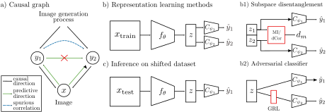

# Benchmarking Dependence Measures to Prevent Shortcut Learning in Medical Imaging
This repository contains the code to reproduce the results from the paper "Benchmarking Dependence Measures to Prevent Shortcut Learning in Medical Imaging", which was accepted to the Machine Learning in Medical Imaging (MLMI) 2024 workshop.

We present a comprehensive performance comparison of dependency measures to prevent shortcut learning in medical imaging.



# Installation

Setup a python environment with a python version `3.10`. Then, download the code from https://anonymous.4open.science/r/dependence-measures-medical-imaging, activate the environment and install all other dependencies with
```
cd dependence-measures-medical-imaging
pip install --editable . 
```

This installs the code in `src` as an editable package and all the dependencies in `requirements.txt`.

# Organization of the repo
* [configs](./configs/): Configuration files for all experiments.
* [scripts](./scripts/): Slurm scripts for model training and hyperparameter sweeps.
* [src](./scripts/): Main source code to run the experiments.
    * [data](./src/data/): Pytorch datasets and scripts/info to download data.
    * [models](./src/models/): Pytorch lightning module to train models to prevent shortcut learning with different methods.
    * [eval](./src/eval/): Model evaluation with kNN classifiers and embedding plots.
* [train.py](./src/train.py): Main training script to train k-fold cross validation (and optional hyperparameter sweeps).


# Usage

## Download public datasets
First, you need to download the two data sets Morpho-MNIST and CheXpert.
For Morpho-MNIST we have a download script:
```
python src/data/download_data/load_morpho_mnist.py -d path-to-dataset-directory -v True
```
For CheXpert you need to register, hence we provide additional information on how to register and download the dataset: [load_chexpert.txt](src/data/download_data/load_chexpert.txt).

## Train one method
To run k-fold cross-validation for one method you need to hand over a config file to the train script. For example, for MINE with the Morpho-MNIST dataset the comand-line interface is 
```
python src/train.py -tc configs/morpho-mnist/mine.yaml
```
Note: The `dataset_path` needs to be adjusted in the config file.

To run the code on a slurm cluster, we provide a bash script:
```
sbatch scripts/train.sh configs/morpho-mnist/mine.yaml
```

## Run hyperparameter sweeps (wandb)
Initialize the sweep with
```
python src/utils/sweep_init.py -sc configs/example_sweep.yaml
```
This will print out the `sweep_id` that you can hand over to the script to start multiple runs (10 in this case) on a slurm cluster
```
sh scripts/sweep.sh 10 configs/morpho-mnist/mine.yaml sweep_id
```

## Evaluation
To evaluate the trained models for the confusion matrix of kNN classifier accuracy for one model run
```
python src/eval/knn_classifier.py -c model_config -ckpts model_checkpoints
```
To generate the embedding plots of the paper run
```
python src/eval/embeddings.py -cfgs list_of_model_configs -ckpts list_of_model_checkpoints
```

## Cite
Until the MLMI processings are published, please cite the preprint
```bibtex
@inproceedings{smueller2024benchmarking,
	author = {M\"uller, Sarah and Fay, Louisa and Koch, Lisa M. and Gatidis, Sergios and K\"ustner, Thomas and Berens, Philipp},
	title = {Benchmarking Dependence Measures to Prevent Shortcut Learning in Medical Imaging},
	year = {2024},
	doi = {},
	URL = {},
}
``` 